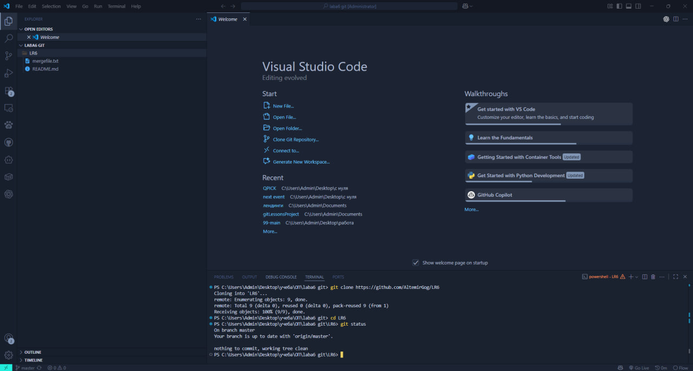
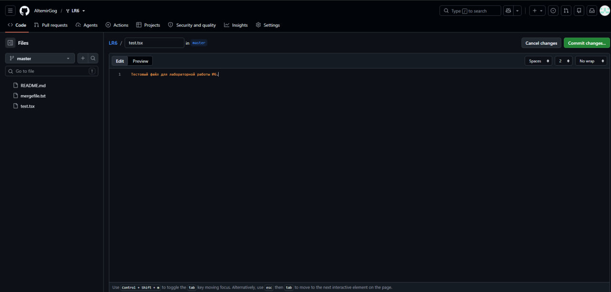
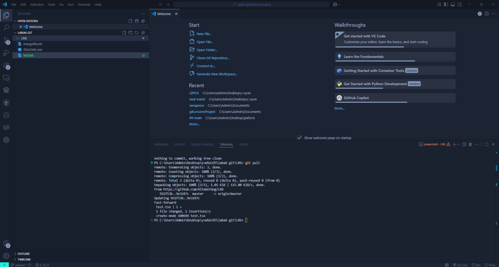
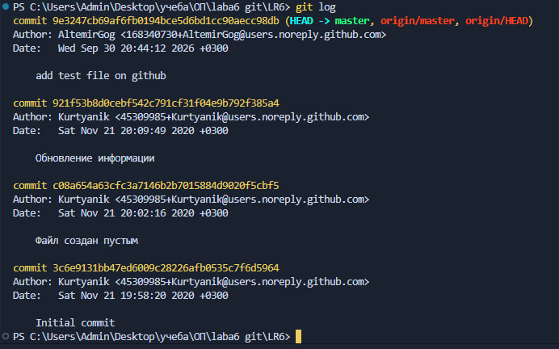
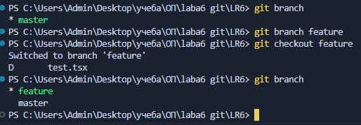
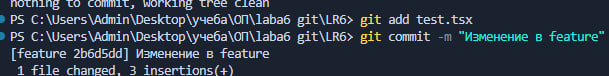
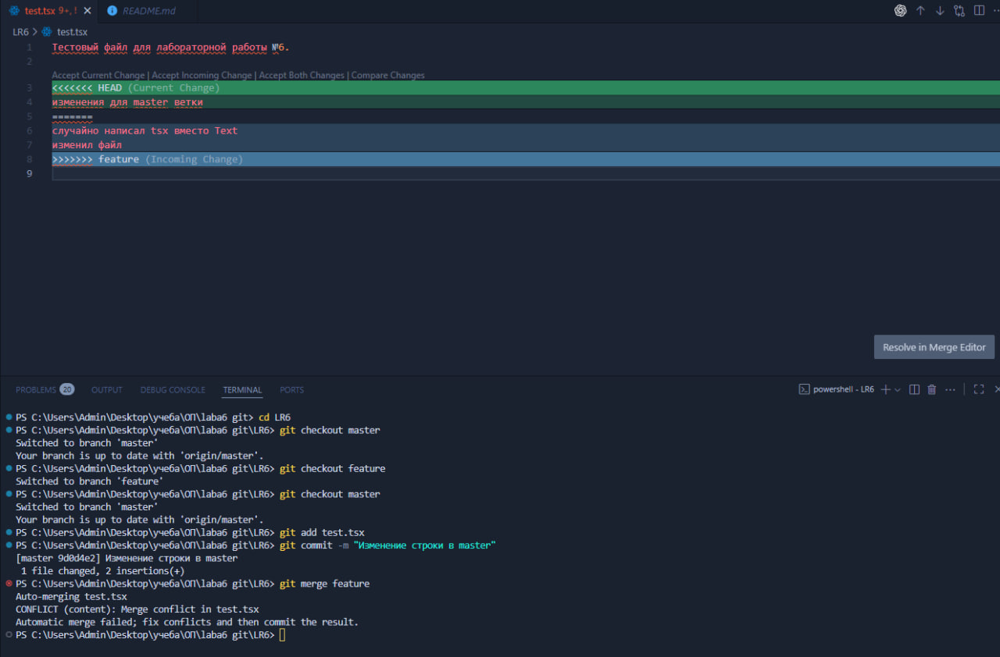
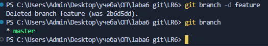
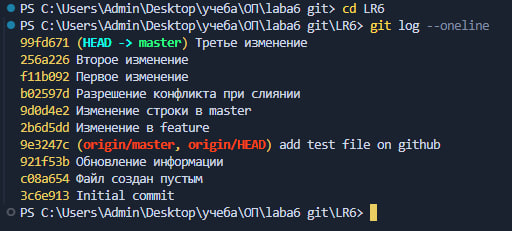

<div align="center">

# ГУАП
## КАФЕДРА № 41

</div>

**ОТЧЕТ**  
**ЗАЩИЩЕН С ОЦЕНКОЙ**

**ПРЕПОДАВАТЕЛЬ**  
старший преподаватель, Т.Р. Мустафин

<div align="center">

# ОТЧЕТ О ЛАБОРАТОРНОЙ РАБОТЕ №6
## «СИСТЕМА КОНТРОЛЯ ВЕРСИЙ»

## ПО ДИСЦИПЛИНЕ "ОСНОВЫ ПРОГРАММИРОВАНИЯ"

</div>


**Студент гр. № 4515 А.Т. Гогуноков**  
**Санкт-Петербург, 2026**

---

## 1. Цель лабораторной работы

Изучение базовых возможностей системы управления версиями, опыт работы с Git Api, опыт работы с локальным и удаленным репозиторием. 

## 2. Задание

1. Создать аккаунт на сайте GitHub.
2. Сделать копию в личное хранилище из
https://github.com/Kurtyanik/LR6/ (Fork).
3. Установить Git (https://git-scm.com/).
4. После установки настроить клиент git, введя имя пользователя (Группа
Фамилия И.О.) и email.
5. Клонировать свой личный удалённый репозиторий на компьютер.
6. Добавить файл через интерфейс GitHub. Подтянуть изменения в
локальный репозиторий.
Работу продолжать локально.
7. Получить историю операций для каждой из веток.
8. Просмотреть последние изменения.
9. Выполнить слияние в ветку master, разрешив конфликт (можно
использовать специальные редакторы или графический интерфейс git).
10. Удалить побочную ветку после успешного слияния.
11. Сделать изменения и зафиксировать их, оставляя комментарии,
несколько раз.
12. Сделать откат коммита.
13. Создать ветку для отчёта.
14. Начать оформлять отчёт в файле README.md (разрешены сторонние
редакторы с подсветкой синтаксиса), используя markdown синтаксис
(https://guides.github.com/features/mastering-markdown/):
 В отчёте должен быть снимки экрана консоли и сторонних программ.
Файлы снимков экрана разместить в отдельной папке.
 Лог команд (без результатов их выполнения).
При написании отчёта периодически делать коммиты, не забывать
комментировать.
15. Получить историю операций в форматированном виде (сокращённый
хэш + дата + имя автора + комментарий). Добавить её в отчёт и сделать
финальную фиксацию изменений.
16. Отправить локальные изменения в сетевое хранилище GitHub (если
делаете работу постепенно, то синхронизацию проводить в конце рабочего
сеанса)
В ЛК загрузить титульный лист и ссылку на свой репозиторий в формате PDF. 

## 3. Выполнение лабораторной работы

### 3.1. Создание личного репозитория на GitHub

Для выполнения лабораторной работы был использован сервис GitHub. Исходный репозиторий лабораторной работы был скопирован в личное хранилище с помощью операции **Fork**.

После выполнения Fork был получен личный удаленный репозиторий, с которым в дальнейшем выполнялась работа.

---

### 3.2. Установка и настройка Git

На компьютере был установлен Git. Проверка установки выполнялась с помощью команды `git --version`.

Для корректного формирования истории коммитов были настроены имя пользователя и адрес электронной почты. Эти параметры использовались при создании последующих коммитов.

Основные команды настройки:

```bash
git --version
git config --local user.name "Фамилия И.О."
git config --local user.email "email@gmail.com"
git config --local --list
```

---

### 3.3. Клонирование удаленного репозитория

Личный репозиторий был клонирован на локальный компьютер. Для этого использовалась команда `git clone` с адресом личного репозитория GitHub.

После клонирования был выполнен переход в каталог репозитория и проверено его состояние.

```bash
git clone https://github.com/AltemirGog/LR6.git
cd LR6
git status
```


**Рисунок 1 – Клонирование репозитория и проверка состояния**


---

### 3.4. Добавление файла через GitHub и получение изменений

Для проверки взаимодействия локального и удаленного репозиториев через интерфейс GitHub был создан дополнительный файл. Изменение сначала появилось в удаленном репозитории.

**Рисунок 2 – Добавление нового файла**


После этого в локальном репозитории была выполнена команда `git pull`, которая получила изменения из удаленного репозитория.

```bash
git pull
```

В результате созданный через веб-интерфейс GitHub файл появился в локальной копии репозитория.

**Рисунок 3 – Получение изменений из удаленного репозитория**


---

### 3.5. Работа с историей Git

Для просмотра истории выполненных операций использовалась команда `git log`.

```bash
git log
git branch
```

История позволяет увидеть созданные коммиты, их сокращенные хэши, авторов, даты и комментарии. Команда `git branch` использовалась для просмотра существующих веток и определения текущей ветки.

**Рисунок 4 – История коммитов**


**Рисунок 4 – Ветки**


---

### 3.6. Создание и изменение дополнительной ветки

Для работы с отдельной линией разработки была создана дополнительная ветка. В ней были выполнены изменения, отличающиеся от состояния основной ветки.

Для создания и переключения на новую ветку использовались команды:

```bash
git branch feature
git checkout feature
```

После внесения изменений они были добавлены в индекс и зафиксированы коммитом:

```bash
git add .
git commit -m "Изменение в feature"
```

Таким образом была создана отдельная ветка с собственной историей изменений.

**Рисунок 6 – Выполнение коммита**



---

### 3.7. Создание конфликта при слиянии

Для демонстрации разрешения конфликтов одна и та же часть файла была изменена по-разному в двух ветках.

Сначала изменение было выполнено в дополнительной ветке `feature`. Затем была выбрана основная ветка `master`, где та же строка была изменена другим способом.

После этого была выполнена команда слияния:

```bash
git checkout master
git merge feature
```

В результате Git обнаружил конфликт, так как в обеих ветках были разные изменения одного и того же участка файла.

Для разрешения конфликта ненужные маркеры были удалены, а окончательный вариант содержимого файла был выбран вручную. После исправления файл был снова добавлен в индекс и конфликт был зафиксирован отдельным коммитом.

**Рисунок 7 – Возникновение конфликта при слиянии**



---

### 3.8. Удаление побочной ветки

После успешного завершения слияния дополнительная ветка была удалена, так как ее изменения уже были перенесены в `master`.

```bash
git branch -d feature
git branch
```

После удаления в списке веток осталась основная ветка репозитория.

**Рисунок 9 – Удаление побочной ветки**



---

### 3.9. Создание нескольких коммитов

Для изучения истории изменений было выполнено несколько последовательных изменений файлов. Каждое изменение отдельно фиксировалось коммитом с поясняющим сообщением.

Пример последовательности команд:

```bash
git add .
git commit -m "Первое изменение"

git add .
git commit -m "Второе изменение"

git add .
git commit -m "Третье изменение"
```

После этого в истории репозитория появилось несколько последовательных коммитов.

---

### 3.10. Откат коммита

Для отмены одного из последних изменений использовалась команда `git revert`. В отличие от удаления записи из истории, `revert` создает новый коммит, который отменяет изменения указанного коммита.

Сначала была просмотрена история:

```bash
git log --oneline
```

После определения необходимого коммита был выполнен откат:

```bash
git revert <Хэш коммита>
```

В результате отмененные изменения были возвращены в рабочем состоянии репозитория, при этом информация о предыдущем коммите сохранилась в истории.

**Рисунок 10 – Выполнение отката коммита**



---

### 3.11. Создание ветки для отчета

Для непосредственного оформления отчета была создана отдельная ветка `otchet`.

```bash
git branch otchet
git checkout otchet
```

В этой ветке был создан и постепенно заполнялся файл `README.md`, содержащий текст отчета в формате Markdown.

---

### 3.12. Оформление отчета в README.md

Отчет оформлялся непосредственно в файле `README.md` с использованием синтаксиса Markdown.

В соответствии с заданием в отдельную папку были вынесены снимки экрана консоли и программ, а в README были добавлены подписи к рисункам и описание выполненных действий.

Для сохранения промежуточных результатов оформления выполнялись отдельные коммиты.

```bash
git add README.md
git commit -m "Сообщение"
```

В ходе работы отчет дополнялся и повторно фиксировался в истории репозитория.

---

### 3.13. Получение форматированной истории операций

Для заключительной части отчета была получена история операций в сокращенном формате, содержащем хэш коммита, дату, имя автора и комментарий.

Для этого использовалась команда:

```bash
git log --pretty=format:"%h | %ad | %an | %s" --date=short
```

Полученный результат был добавлен в заключительную часть отчета.

**Таблица 1 – Формат истории операций**

| Сокращенный хэш | Дата | Автор | Комментарий |
|--------|------------|--------|-|
|492c9cc | 2026-09-30 | AGTim7 | практически закончил писать ход работы
|7fb6170 | 2026-09-30 | AGTim7 | Написал пару пунктов по выполненной работе, дошел до удаления ветки
|81f620b | 2026-09-30 | AGTim7 | Написал пару начальных пунктов выполнения работы
|457d996 | 2026-09-30 | AGTim7 | добавил цель работы и задание
|9718a9d | 2026-09-30 | AGTim7 | Все скрины и титульник
|a90fe25 | 2026-09-30 | AGTim7 | Revert "Третье изменение"
|99fd671 | 2026-09-30 | AGTim7 | Третье изменение
|256a226 | 2026-09-30 | AGTim7 | Второе изменение
|f11b092 | 2026-09-30 | AGTim7 | Первое изменение


---

### 3.14. Финальная фиксация и отправка изменений на GitHub

После завершения оформления отчета была выполнена финальная фиксация изменений, а затем локальная ветка `otchet` была отправлена в удаленный репозиторий GitHub.

```bash
git add .
git commit -m "Финальная версия отчета"
git push -u origin otchet
```

В результате все локальные изменения и история работы были синхронизированы с удаленным репозиторием.

---

## 4. Лог команд

В соответствии с заданием в отчете приводится лог команд без результатов их выполнения.

```text
git --version
git config --global user.name "Фамилия И.О."
git config --global user.email "email@gmail.com"
git config --global --list
git clone https://github.com/AltemirGog/LR6.git
cd LR6
git status
git pull
git log
git log --oneline
git branch
git switch -c feature
git add .
git commit -m "Изменение в feature"
git checkout master
git add .
git commit -m "Изменение строки в master"
git merge feature
git add .
git commit -m "Разрешение конфликта при слиянии"
git branch -d feature
git branch
git add .
git commit -m "Первое изменение"
git add .
git commit -m "Второе изменение"
git add .
git commit -m "Третье изменение"
git log --oneline
git revert <HASH_КОММИТА>
git branch otchet
git checkout otchet
git add README.md
git commit -m "Добавлен отчет"
git log --pretty=format:"%h | %ad | %an | %s" --date=short
git add .
git commit -m "Финальная версия отчета"
git push -u origin otchet
```

---

## 6. Вывод

В ходе лабораторной работы были изучены базовые возможности системы контроля версий Git и принципы работы с локальным и удаленным репозиториями.

На практике были освоены создание копии репозитория на GitHub, клонирование репозитория на локальный компьютер, получение удаленных изменений, просмотр истории операций, создание и удаление веток, слияние веток и разрешение конфликтов.

Кроме того, были изучены последовательная фиксация изменений в виде коммитов, просмотр истории и отмена отдельного коммита с помощью `git revert`. Для подготовки отчета использовалась отдельная ветка `otchet`, а сам отчет был оформлен в формате Markdown.

Таким образом, в ходе работы были получены практические навыки использования Git для управления версиями проекта и синхронизации локальных и удаленных изменений.